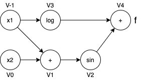

# Introduction 
_Describe the problem the software solves and why it's important to solve that problem_

Our software package, *AD-FBI*, computes gradients using the technique of automatic differentiation. Automatic differentiation is important because it is able to solve the derivatives of complex functions at low cost while maintaining accuracy and stability. Its high practicality and precision make it applicable to a wide range of tasks, such as machine learning optimization, calculating financial loss or profit, and minimizing the cost of vaccine distribution. Automatic differentiation plays a crucial role in solving these problems. 

Prior to the technique of automatic differentiation, the two traditional computational techniques for solving differential equations are numerical differentiation and symbolic differentiation. The numerical differentiation method computes derivatives based on a finite numerical approximation which lacks stability and precision, and thus it is not ideal to be implemented in computer software. On the other hand, symbolic differentiation can become very computationally expensive as the function becomes more and more complex. 

The automatic differentiation technique transforms the entire computational process into a sequence of elementary arithmetic operations -- addition, subtraction, multiplication, division, and elementary functions. And then, it applies the chain rule on top of these elementary operations. In this way, it reduces the computational complexity that the model can reuse some of its parts computed in previous steps multiple times without re-calculating them. It keeps the same level of accuracy and precision as using symbolic differentiation. 

Our software package computes derivatives using the forward mode of auto differentiation and will later explore other extensions(different optimeizer). 


# Background
_Describe (briefly) the mathematical background and concepts as you see fit._


* __Chain Rule__

Chain Rule is the most important concept in automatic differentiation. To solve the derivatives of a composite function, we use the Chain Rule to decompose each variable in the function into elementary components and mulptily them together. 

For a given function $f(y(x))$, the derivative of $f$ with respect to $ x $ is the following:

$$
\begin{align}
\frac{\partial f}{\partial x} = \frac{\partial f}{\partial y} \frac{\partial y}{\partial x}\\
\end{align}
$$

Since $y$ is a n-dimensional vector, we introduce the gradient operator $ \nabla $ into the expression to calculate the derivative of $y$ with respect to $x$, where $x = (x_1, ..., x_n)$:

$$
\begin{align}
\nabla y(x) =
\begin{bmatrix}
{\frac {\partial y}{\partial x_{1}}}(x)
\\
\vdots 
\\
{\frac {\partial y}{\partial x_{n}}}(x)
\end{bmatrix}
\end{align}
$$

The above expression is for a single $y$, but we typically have multiple $y$ in a neural network. Thus, for a given function $f(y_1(x), ..., y_n(x))$, the derivative of $f$ with respect to $x$ is defined as the following:

$$
\begin{align}
\nabla f_x = \sum_{i=1}^n \frac{\partial f}{\partial y_i} \nabla y_i(x)\\
\end{align}
$$


* __Forward Mode automatic differentiation__

Here we will give an example of how to do forward mode automatic differentiation.

Given x = $\begin{bmatrix} {x_1} \\ \vdots \\ {x_m} \end{bmatrix}$, where $k \in (1, 2, ..., m)$, we introduce the intermediate operations $ v $ to compute values at each elementary operation step.

For example, to compute the gradient $\nabla f$  of the function $f(x) = log(x_1) + sin(x_1 + x_2)$, the expression is derived as the following:

$\nabla f = \begin{bmatrix} \frac {\partial f} {\partial x_1} \\ \frac {\partial f} {\partial x_2} \end{bmatrix}  = \begin{bmatrix} \frac {1} {x_1} + \cos(x_1 + x_2) \\ \cos(x_1 + x_2) \end{bmatrix}$

The computation graph is shown here: 


$D_p v_{-1} = \nabla v_{-1}^T p = (\frac {\partial v_{-1}} {\partial x_1} \nabla x_{1})^T p = (\nabla x_{1})^T p = p_1$

$D_p v_{0} = \nabla v_{0}^T p = (\frac {\partial v_{0}} {\partial x_2} \nabla x_{2})^T p = (\nabla x_{2})^T p = p_2$

$D_p v_{1} = \nabla v_{1}^T p = (\frac {\partial v_{1}} {\partial v_{-1}} \nabla v_{-1} + \frac {\partial v_{1}}{\partial v_{0}} \nabla v_{0})^T p = (\nabla v_{-1} + \nabla v_0)^T p = D_p v_{-1} + D_p v_0$

$D_p v_{2} = \nabla v_{2}^T p = (\frac {\partial v_{2}} {\partial v_{1}} \nabla v_1)^T p = \cos(v_1) (\nabla v_1)^T p = \cos(v_1) D_p v_1$

$D_p v_{3} = \nabla v_{3}^T p = (\frac {\partial v_{3}} {\partial v_{-1}} \nabla v_{-1})^T p = \frac {1} {v_{-1}} (\nabla v_{-1})^T p = \frac {1} {v_{-1}} D_p v_{-1}$

$D_p v_{4} = \nabla v_{4}^T p = (\frac {\partial v_{4}} {\partial v_3} \nabla v_{3} + \frac {\partial v_{4}}{\partial v_{2}} \nabla v_{2})^T p = (\nabla v_{3} + \nabla v_2)^T p = D_p v_{3} + D_p v_2$

Thus, the final generalized formula is the following:

$$ D_p v_j = (\nabla v_j)^T p = (\sum_{i < j} \frac{\partial{v_j}} {\partial{v_i}} \nabla v_i)^T p = \sum_{i < j} \frac{\partial{v_j}} {\partial{v_i}} (\nabla v_i)^T p = \sum_{i < j} \frac{\partial{v_j}} {\partial{v_i}} D_p v_i$$ 


* __Jacobian Matrix__

Having derived the above system of equations, we want to use the Jacobian matrix to compute these derivatives systematically.

The Jacobian matrix is defined as the following:

$$
J_{p}(x_{1},x_{2}, ... x_{n}) = \left[ \begin{matrix}
\frac{\partial y_{1}}{\partial x_{1}} & ... & \frac{\partial y_{1}}{\partial x_{n}} \\
\vdots  & \ddots & \vdots  \\
\frac{\partial y_{m}}{\partial x_{1}} & ... & \frac{\partial y_{m}}{\partial x_{n}}
\end{matrix} \right] 
$$


For example, a 2 by 2 Jacobian matrix with 2 variables looks like the following:

$$
J_{p}(x_{1},x_{2}) = \left[ \begin{matrix}
\frac{\partial y_{1}}{\partial x_{1}} & \frac{\partial y_{1}}{\partial x_{2}} \\
\frac{\partial y_{2}}{\partial x_{1}} & \frac{\partial y_{2}}{\partial x_{2}}
\end{matrix} \right] 
$$

We compute $J_{p}$ in the forward mode in the evaluation trace.


# How to use AD-fbi
_How do you envision that a user will interact with your package? What should they import? How can they instantiate AD objects?_

1. __Installing the package:__
   * a. Users will install our package with the following line: 
    
    <code>python3 -m pip install AD-fbi </code>
      
   * b. Users will install dependencies from requirements.txt with the following command: 

    <code>python3 -m pip install requirements.txt </code>


2. __Importing the package:__

   * Users import our package using the following line:
    
    ```python
    from AD-fbi import dual_fbi, forward_mode, optimization
    ```
    

    
    
3. __Instantiating AD objects:__
   * In order to instantiate an AD object, we need:
      - a input variable (either a scalar or a vector) with the specific value at which the function and the derivative will be evaluated 
      - the function of the input variable
   
   The following are two examples to instantiate AD objects:

   * a. Instantiate an AD object for a scalar function:

   ```python

   from AD-fbi import dual_fbi, forward_mode, optimization
   from AD-fbi.forward_mode import ForwardMode

   # input variable - a scalar
   inp = np.array([0.5]) 

   # define the function
   f_inp =  2 * inp + 100

   # instantiate an AD object
   fm = ForwardMode(evaluate = inp, function = f_inp)
   ```

   * b. Instantiate an AD object for a vector function:
   ```python  
   from AD-fbi import dual_fbi, forward_mode, optimization
   from AD-fbi.forward_mode import ForwardMode

   # input variable - a vector
   inp = np.array([0.5, 0.5, 1, 1, 2]) 

   # define the function
   f_inp = 2 * inp + 100

   # instantiate an AD object
   fm = ad.ForwardMode(evaluate = inp, function = f_inp)
   ```

# Software Organization
_Discuss how you plan on organizing your software package._


* __What will the directory structure look like?__
   * Our package is called _AD-fbi_, the following is the planned directory structure.
  
    
```bash
   
   team06/
      AD-fbi/
         __init__.py
         dual_fbi.py
         forward_mode.py
         optimization.py
      docs/
        milestone1.md
        documentation.md
      tests/
        test_dual.py
        test_forwardmode.py
        test_optimiz.py
      requirements.txt
      setup.py
      setup.cfg
      README.md
      LICENSE

``` 

* __What modules do you plan on including? What is their basic functionality?__

   There will be 2 essential modules for forward mode automatic differentiation and one extension module that will be implemented later in the project development. The followings are the decriptions of their basic functionalities:

   * _dual_fbi.py_: This module will contain the DualNumber class which contains methods to compute the function and derivative values of the elementary operations, and to overload the elementary operations for a dual number. These functions are essential to compute the primal and tangent trace in the forward mode of AD. Examples of elementary operations include: '+', '-', '*' '/', 'sqrt(x)'.
    
   * _forward_mode.py_: This module will contain a ForwardModel class that provides a method to intialize a forward mode AD object, a method to construct a computational graph dictionary, and a method to run the forward mode process and returns the computed derivative of the function at the evaluation point.

   * _optimization.py_ (extension module): This module will contain extensions to the basic automatic differentiation functionalities. We aim to develop this module to develop optimizers such as the Adam optimizer for stochastic gradient descent. 


*  __Where will your test suite live?__
   * The test suite will live in the "tests" directory, a subdirectory of our package root directory. It will contain all unit tests, integration tests, system and acceptance tests for our package. GitHub Actions, a CI provider, will be deployed to see which of our tests are passing/failing. All of the CI setup, jobs, and dependencies will be defined in YAML files.
    
    
* __How will you distribute your package?__
   * The package will be distributed via PyPI. We will first add a _pyproject.toml_ file to our project, then install `build` (a PEP517 package builder). After that, build our package release and finally upload to PyPI. We also plan to add setup.py and setup.cfg files to set up the backend of our package development.

   
* __Other Considerations?__
   * Package dependencies: We will rely on the following external functionalities:
      - numpy
      - pytest


# Implementation

_Discuss how you plan on implementing the forward mode of automatic differentiation._

* What classes do you need and what will you implement first?
  * a. DualNumbers: class for operations with a dual number.
  * b. ForwardMode: class for forward mode differentiation.
* What are the core data structures? How will you incorporate dual numbers?
  * The core data structure is a dictionary which is used to represent the computational graph. The key of the dictionary is the state name of the computational graph. The value of the dictionary is a tuple holding a function value and a derivative at specific state.
* What method and name attributes will your classes have?
  * a. DualNumbers: 
    * Method to initialize a DualNumber object with the real value and dual number value.
    * Method to return the object representation in string format.
    * Methods to overload the elementary operations for a dual number. e.g. `__add__`, `__sub__`, `__mul__`, `__div__`, `__pow__`, `__radd__`, `__rsub__`, `__rmul__`, `__rdiv__`, `__rpow__`, etc.
    * Methods to compare dual numbers. e.g. `__ne__`, `__eq__`, etc.
    * Methods to transform a dual number. e.g. `sqrt`, `log`, `sin`, `cos`, `exp`, `tan`, etc.
  * b. ForwardMode:
    * Method to initialize a ForwardMode Object with a point, a function, and a seed vector.
    * Method to initialize the computational graph dictionary with state name as the key and a tuple of the primal trace and the tangent trace as the value.
    * Method to construct the computational graph dictionary by computing primal trace and tangent trace iteratively.
    * Method to run the forward mode process and return a function value at the evaluation point, and a value of directional derivative corresponding to a specific seed vector.
* Will you need some graph class to resemble the computational graph in forward mode or maybe later for reverse mode?  Note that in milestone 2 you propose an extension for your project, an example could be reverse mode.
  * We are not considering using graph class to resemble the computational graph.(Possibly use dictionary instead)
    
    
* Dealing With Operator Overloading and Elementary Functions

   * For the overloading operator template (like '__add__' for our special dual number class object), we hope it can handle both the case when it's added with another dual number class object or a real number, which are both necessary for computing the gradient in forward mode.

   * For all elementary functions like _sin_, _sqrt_, _log_, and _exp_ we will define separate methods for them. Each method will take in as an input a vector or scalar value stored at the previous node in the computational graph and output the derivative value and function value for that elementary function. We can then store the methods' outputs as a tuple in the computational graph dictionary alongside its primal and tangent traces. 
   
* Dealing With Operator Overloading on Reverse Mode

   * We currently are not interested in implementing a reverse mode on our package.

* Dealing With MultiDimensional Input and Output Function

   * Use Try .. Exceptions to handle multi dimensional and single dimensional case separetly. For multi dimensional case, we will design a helper function to loop through all of the functions inputs and reassign the value/derivative as a vector. 
   * We plan to treat functions as a list (so high dimensional functions will be a list of functions)
   * The grad() function (or jacobian function) will be generic to both single dimensional and multi dimensional(as they are either list of 1 or list of mulitple functions); we will figure out how to handle both situations after we have the output.

* External Dependencies:
   * The only external library we plan to rely on is numpy, which we will use to perform computations and evaluate expressions with.